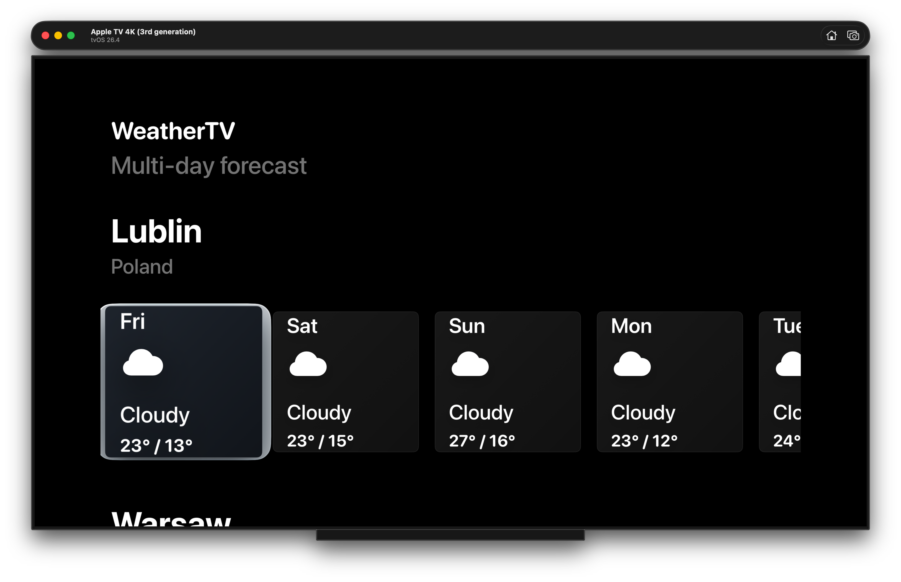
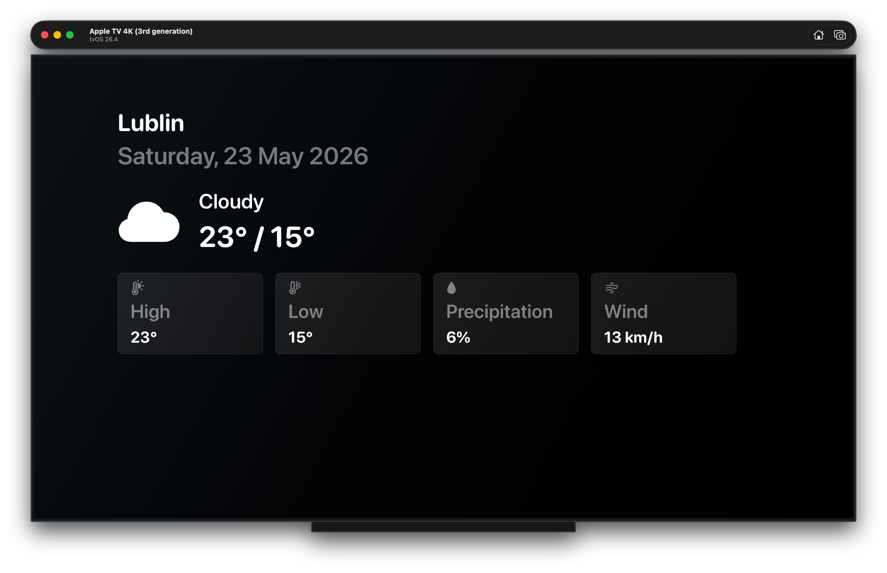

# WeatherTV


WeatherTV is a tvOS weather forecast app built for Apple TV. It presents multi-location weather forecasts in a simple, focus-friendly interface designed for the living room experience.

The project was built as a portfolio app to demonstrate practical tvOS development with SwiftUI, asynchronous networking, state-driven screens, localization, and testable architecture. Weather data is loaded from the real [Open-Meteo API](https://open-meteo.com/), and no API key is required.

## Screenshots

### Dashboard Screen



### Forecast Details Screen



## Features

- Multi-location weather forecast
- 5-day forecast
- tvOS focus navigation
- Forecast details screen
- Loading, empty, and error states
- Retry support
- Localization in English and Polish
- Real Open-Meteo API integration
- Unit tests

## Architecture

WeatherTV follows an MVVM architecture with a small service layer between the UI and networking code.

- **MVVM** keeps SwiftUI views focused on rendering state while view models handle screen logic.
- **Service layer** exposes weather loading through `WeatherServiceProtocol`, making the app easier to test.
- **Dependency Injection** allows production services and mock services to be swapped cleanly.
- **Async/Await networking** keeps API calls readable and structured.
- **DTO to domain mapping** converts Open-Meteo response models into app-specific forecast models.
- **State-driven UI** represents dashboard states explicitly, including loading, loaded, empty, and failed states.

## Project Structure

```text
App/          App entry point and top-level composition
Models/       Domain models such as locations and daily forecasts
Networking/  Open-Meteo endpoint, API client, DTOs, and response mapping
Services/    Weather service protocol, production service, and mock service
ViewModels/  Screen and row view models
Views/       SwiftUI views for dashboard, forecast cards, rows, and details
Resources/   Localization helpers and EN / PL string files
Tests/       Unit tests for view models, networking, localization, and mapping
```

## Technologies

- Swift
- SwiftUI
- tvOS
- Async/Await
- XCTest
- URLSession
- Open-Meteo API

## Setup

1. Clone the repository:

   ```bash
   git clone git@github.com:urszulawiertel/WeatherTV.git
   cd WeatherTV
   ```

2. Open the Xcode project:

   ```bash
   open WeatherTV.xcodeproj
   ```

3. Select a tvOS simulator target.

4. Build and run the app from Xcode.

No API key or additional configuration is required because WeatherTV uses the Open-Meteo API.

## Testing

Run the unit tests from Xcode:

```text
Command + U
```

The test suite covers view model behavior, endpoint construction, error mapping, localization keys, and Open-Meteo forecast mapping.

## Future Improvements

- Editable locations
- Forecast caching
- Favorite locations
- Additional weather metrics
- Improved tvOS animations and transitions
